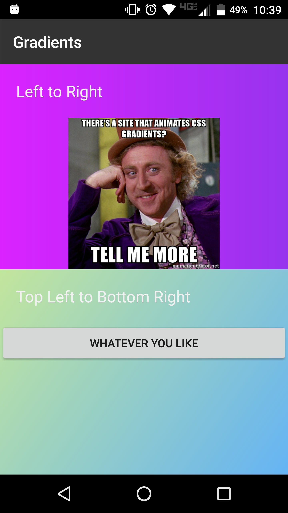
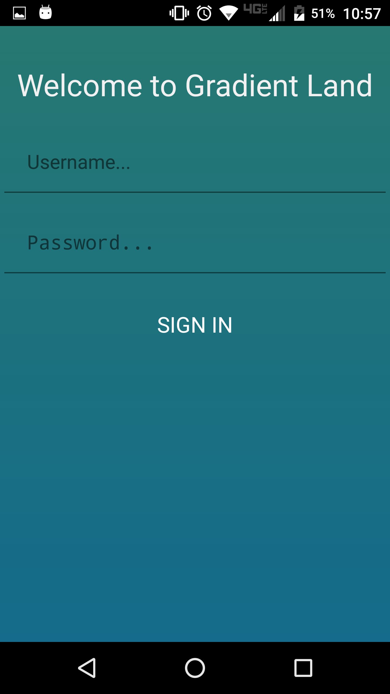

[](https://www.npmjs.com/package/nativescript-gradient)
[](https://www.npmjs.com/package/nativescript-gradient)

# DEPRECATED: a cross platform, no dependency plugin is available [here](https://github.com/EddyVerbruggen/nativescript-gradient)

# NativeScript-Gradient
NativeScript plugin to provide gradient layouts. Gradient support is available in NativeScript using
CSS but I really like the declarative API of this plugin so I'm going to share :smile:


## Samples

Screen 1 |  Screen 2
-------- | ---------
 | 


#### Native Libraries: 
Android | iOS
---------- | -----------
[csdodd/GradientLayout](https://github.com/csdodd/GradientLayout) |  Evaluating native iOS libs...


## Installation
From your command prompt/termial go to your app's root folder and execute:

`tns plugin add nativescript-gradient`

## Usage
#### XML:
```XML
<Page 
  xmlns="http://schemas.nativescript.org/tns.xsd" 
  xmlns:Gradient="nativescript-gradient" loaded="pageLoaded">
  <ActionBar title="Gradients" />
  <StackLayout height="100%">
    <Gradient:Gradient height="50%" startColor="#DA22FF" endColor="#9733EE" orientation="LEFT_RIGHT" id="gradient">
      <StackLayout>
        <Label text="Left to Right" class="info" textWrap="true" />
        <Image src="~/images/wonka.jpg" stretch="aspectFit" />
      </StackLayout>
    </Gradient:Gradient>
    <Gradient:Gradient height="50%" startColor="#c2e59c" endColor="#64b3f4" orientation="TL_BR">
      <StackLayout>
        <Label text="Top Left to Bottom Right" class="info" textWrap="true" />
        <Button text="WHATEVER YOU LIKE" tap="gotoMain" height="50" />
      </StackLayout>
    </Gradient:Gradient>
  </StackLayout>
</Page>

```


## Attributes
**startColor - (color string)** - *required*

Attribute to set the starting color of the gradient.
 
**endColor - (color string)** - *required*

Attribute to set the ending color of the gradient.

**orientation - (string)** - *optional* --- Default is Top to bottom direction.

#### Android Orientation Options
 These values determine the starting and end of the gradient.
- BL_TR (Bottom Left to Top Right)
- BOTTOM_TOP (Bottom to Top)
- BR_TL (Bottom Right to Top Left)
- LEFT_RIGHT (Left to Right)
- RIGHT_LEFT (Rigth to Left)
- TL_BR (Top Left to Bottom Right)
- TOP_BOTTOM (Top to Bottom) *default if not specified*
- TR_BL (Top Right to Bottom Left)
